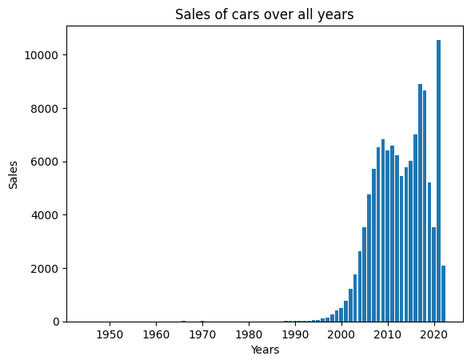
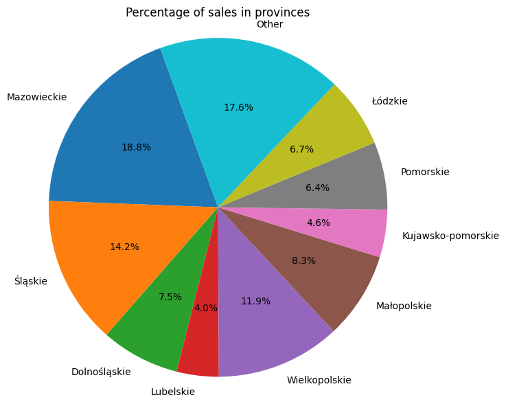
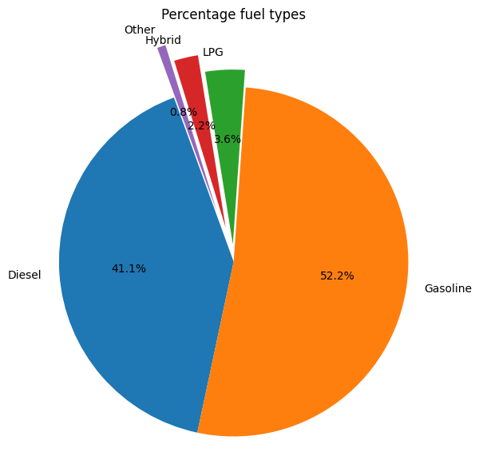

# First Jupyter Notebook

## Database I'm using

-- https://www.kaggle.com/datasets/aleksandrglotov/car-prices-poland?resource=download


```python
import numpy as np
import matplotlib.pyplot as plt
import pandas as pd

fields = ['id', 'mark', 'model', 'generation_name', 'year', 'mileage', 'vol_engine', 'fuel', 'city', 'province', 'price']
data = pd.read_csv("./Car_Prices_Poland_Kaggle.csv", sep=',', usecols=fields)

df = pd.DataFrame(data=data, columns=fields)
print(df)
```

                id   mark  model    generation_name  year  mileage  vol_engine  \
    0            0   opel  combo         gen-d-2011  2015   139568        1248   
    1            1   opel  combo         gen-d-2011  2018    31991        1499   
    2            2   opel  combo         gen-d-2011  2015   278437        1598   
    3            3   opel  combo         gen-d-2011  2016    47600        1248   
    4            4   opel  combo         gen-d-2011  2014   103000        1400   
    ...        ...    ...    ...                ...   ...      ...         ...   
    117922  117922  volvo  xc-90  gen-ii-2014-xc-90  2020    40000        1969   
    117923  117923  volvo  xc-90  gen-ii-2014-xc-90  2017    51000        1969   
    117924  117924  volvo  xc-90  gen-ii-2014-xc-90  2016    83500        1969   
    117925  117925  volvo  xc-90  gen-ii-2014-xc-90  2017   174000        1969   
    117926  117926  volvo  xc-90  gen-ii-2014-xc-90  2016   189020        1969   
    
                fuel              city       province   price  
    0         Diesel             Janki    Mazowieckie   35900  
    1         Diesel          Katowice        Śląskie   78501  
    2         Diesel             Brzeg       Opolskie   27000  
    3         Diesel         Korfantów       Opolskie   30800  
    4            CNG   Tarnowskie Góry        Śląskie   35900  
    ...          ...               ...            ...     ...  
    117922    Hybrid          Katowice        Śląskie  222790  
    117923    Diesel  Chechło Pierwsze        Łódzkie  229900  
    117924  Gasoline   Pruszcz Gdański      Pomorskie  135000  
    117925    Diesel            Kalisz  Wielkopolskie  154500  
    117926  Gasoline            Sionna    Mazowieckie  130000  
    
    [117927 rows x 11 columns]
    

## Bar diagram showing sales of cars over the years:


```python
# fill !dict_of_sales keys by inputing !years values

dict_of_sales = {}
for i in df.index:
    if df.year[i] not in dict_of_sales.keys():
        dict_of_sales[df.year[i]] = 1
    else:
        dict_of_sales[df.year[i]] += 1

dict(sorted(dict_of_sales.items()))

# show number of sales for each year with !dict_of_sales

dict_years_keys = list(dict_of_sales.keys())
dict__years_vals = list(dict_of_sales.values())
figBar ,ax=plt.subplots()
ax.bar(dict_years_keys, dict__years_vals)
ax.set_xlabel("Years")
ax.set_ylabel("Sales")
ax.set_title("Sales of cars over all years")
```


    Text(0.5, 1.0, 'Sales of cars over all years')


    

    


## Sales in each province:


```python
# prepare !dict_of_provinces keys by inputing !years values

dict_of_provinces = {}
for i in df.index:
    if df.province[i] not in dict_of_provinces.keys():
        dict_of_provinces[df.province[i]] = 1
    else:
        dict_of_provinces[df.province[i]] += 1

# combining to table other with value less than 3.5% of all
all = len(df.index)

dict_of_provinces["Other"] = 0
list_of_toDelete = []
for i in dict_of_provinces.keys():
    if float(dict_of_provinces[i]) / all < 0.035 and i != "Other":
        dict_of_provinces["Other"] += dict_of_provinces[i]
        list_of_toDelete.append(i)

#delete from dictionary keys no longer in interest
for i in list_of_toDelete:
    del dict_of_provinces[i]

dict_provinces_keys = list(dict_of_provinces.keys())
dict_provinces_vals = list(dict_of_provinces.values())
figPie, bx = plt.subplots(figsize=(7,7))
bx.pie(dict_provinces_vals, labels=dict_provinces_keys, autopct='%1.1f%%',shadow=False, startangle=110)
bx.axis('equal') 
bx.set_title("Percentage of sales in provinces")
```


    Text(0.5, 1.0, 'Percentage of sales in provinces')


    

    


## Percentage of fuel types


```python
#count fuel types of cars in DF
dict_fuel = {}
explode_fuel = []

for i in df.index:
    if df.fuel[i] not in dict_fuel.keys():
        dict_fuel[df.fuel[i]] = 1
    else:
        dict_fuel[df.fuel[i]] += 1

# combining to table other with value less than 3.5% of all

dict_fuel["Other"] = 0
list_of_toDelete = []
inr = 0.0
for i in dict_fuel.keys():
    if float(dict_fuel[i]) / all < 0.01 and i != "Other":
        dict_fuel["Other"] += dict_fuel[i]
        list_of_toDelete.append(i)
    elif float(dict_fuel[i]) / all >= 0.05 and i != "Other":
        explode_fuel.append(0)
    else:
        inr += 0.1
        explode_fuel.append(inr)

#delete from dictionary keys no longer in interest
for i in list_of_toDelete:
    del dict_fuel[i]

#show the percentages in table
dict_fuel_keys = list(dict_fuel.keys())
dict_fuel_vals = list(dict_fuel.values())
figPie, bx = plt.subplots(figsize=(7,7))
bx.pie(dict_fuel_vals, labels=dict_fuel_keys, autopct='%1.1f%%',shadow=False, startangle=110, explode = explode_fuel)
bx.axis('equal') 
bx.set_title("Percentage fuel types")
```

    {'Diesel': 48476, 'CNG': 47, 'Gasoline': 61597, 'LPG': 4301, 'Hybrid': 2621, 'Electric': 885}
    {'Diesel': 48476, 'Gasoline': 61597, 'LPG': 4301, 'Hybrid': 2621, 'Other': 932}
    [0, 0, 0.1, 0.2, 0.30000000000000004]
    


    Text(0.5, 1.0, 'Percentage fuel types')


    

    

